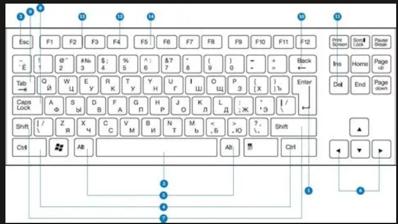
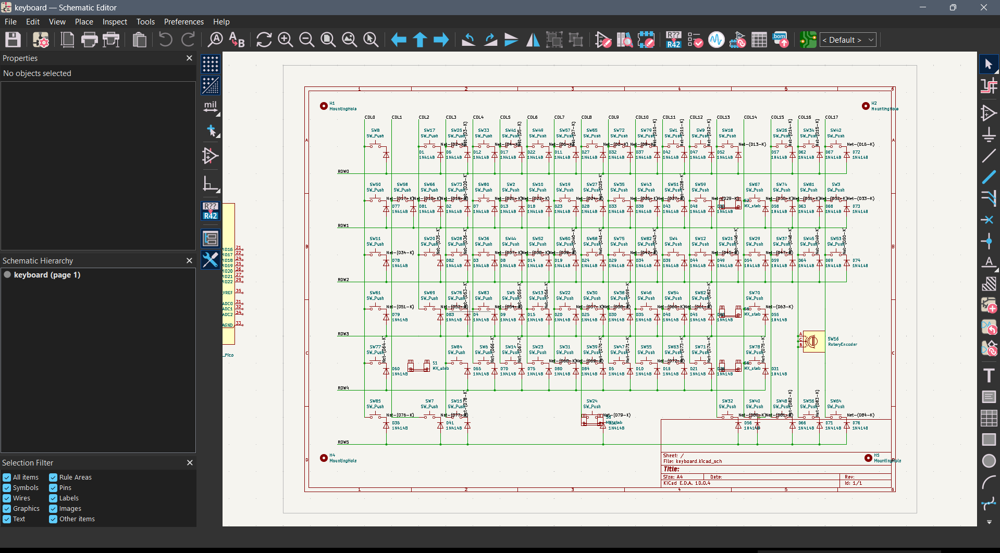
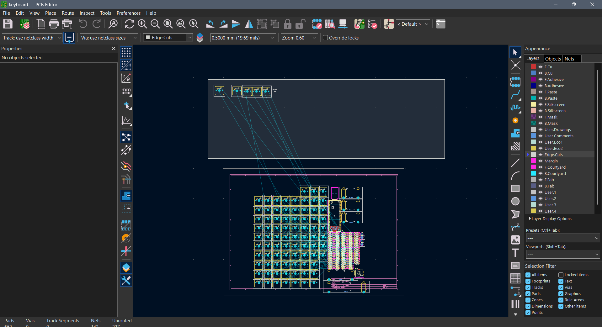

## 15/07/2026 8:55pm

<i>Time spent: 20 mins</i>

Today, I got KiCad setup along with the libraries. It took some troubleshooting due to it not automatically linking the libraries, but chatgpt helped me solve it. I searched for the best keyboard layouts with a volume knob, because i love knobs :D. I have also done part of the schematics. A kind person on the keeb-help channel guided me on how to make a journel, etc so thanks a lot :3

## 16/07/2026 6:25pm
<i>Time spent: 2 hrs 44 mins</i>

Today, i completed the schematic and also tried designing the pcb, but messed up the sizes of stabilisers of keys due to which i had to start again for pcb design. Ughhhh :P. Putting all the keys in layout is pretty difficult, but hopefully i can complete it tomorrow.

