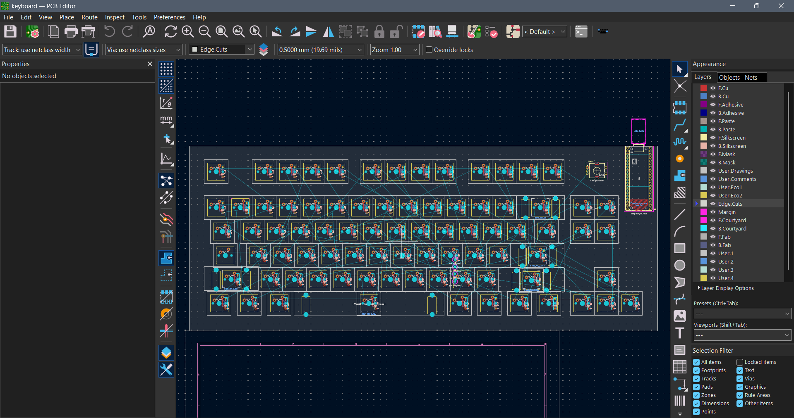
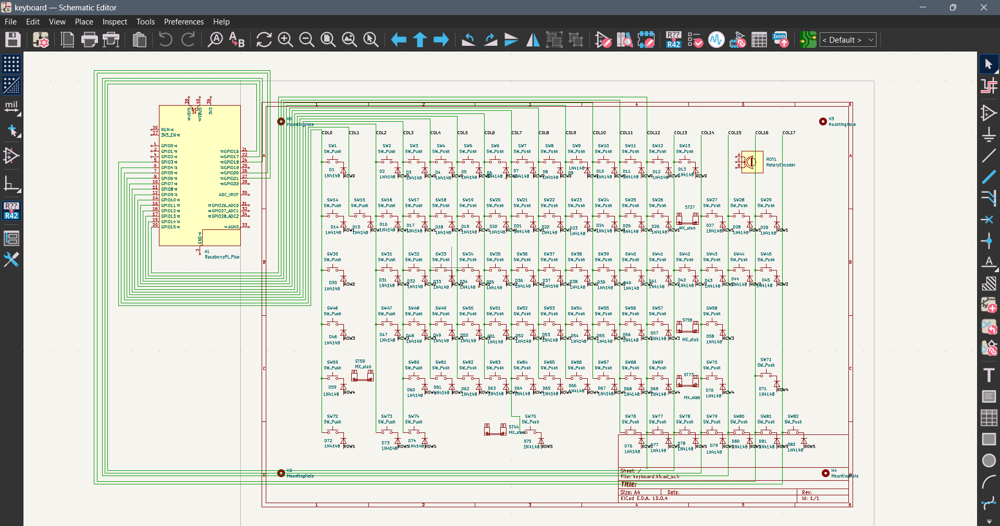

## 15/07/2026 8:55pm

<i>Time spent: 20 mins</i>

Today, I got KiCad setup along with the libraries. It took some troubleshooting due to it not automatically linking the libraries, but chatgpt helped me solve it. I searched for the best keyboard layouts with a volume knob, because i love knobs :D. I have also done part of the schematics. A kind person on the keeb-help channel guided me on how to make a journel, etc so thanks a lot :3

## 16/07/2026 6:25pm
<i>Time spent: 2 hrs 44 mins</i>

Today, i completed the schematic and also tried designing the pcb, but messed up the sizes of stabilisers of keys due to which i had to start again for pcb design. Ughhhh :P. Putting all the keys in layout is pretty difficult, but hopefully i can complete it tomorrow.

## 17/07/2026 6:16pm
<i>Time spent: 2 hrs 37 mins</i>

Today, i finally fixed the pcb design and stabilisers. It took a lot of time and asking AI, ik its dumb but i had to. Making the layout was pretty difficult task even with the plugin that automatically does it for you. Tommorows agenda is to complete the traces.

## 20/07/2026  8:06pm
<i>Time spent: 2hrs</i>

Today, i tried fixing the switches and diodes annotation so that i can put the traces properly, but it kept erroring out. So, i had to reset half my progress and redo it again. Since im tired, im gonna continue renaming the diodes tomorrow.

## 22/07/2026 5:02pm
<i>Time spent: 2hrs 10 mins</i>

Today, i finally fixed the diodes and started marking the traces but i kinda messed up the position of traces. Its kinda difficult to make sure that theres always place for other traces to go without going through another trace. For now, I have connected the switches and connected the traces in the schematic. Imma complete the traces tmr. Ik i keep procrastinating abt completing the traces xD

